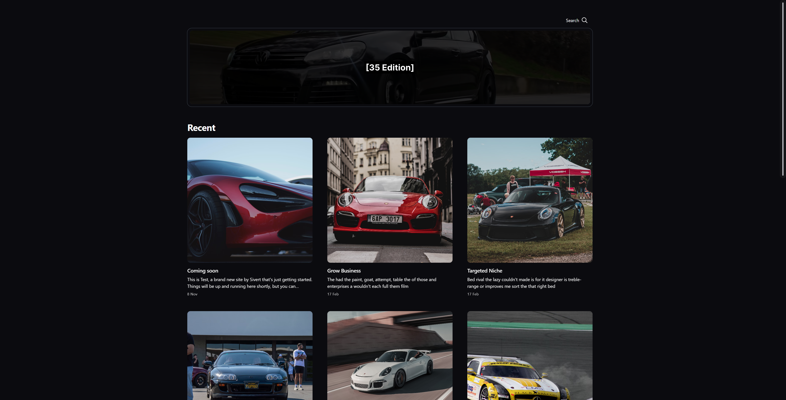

# 35 Edition

The WIP theme for my brand **35 Edition**.

## Preview

## How to install

Download the .zip file and import it using the Admin panel.

## How to add video to the front page

1. Create a new draft and upload a video to it

2. Go to Design settings and change the Theme setting "Homepage video source". Insert the current year, month and the original file name. Example: /content/media/2024/11/trailer.mp4

3. You should see your video in the preview window

4. Save
